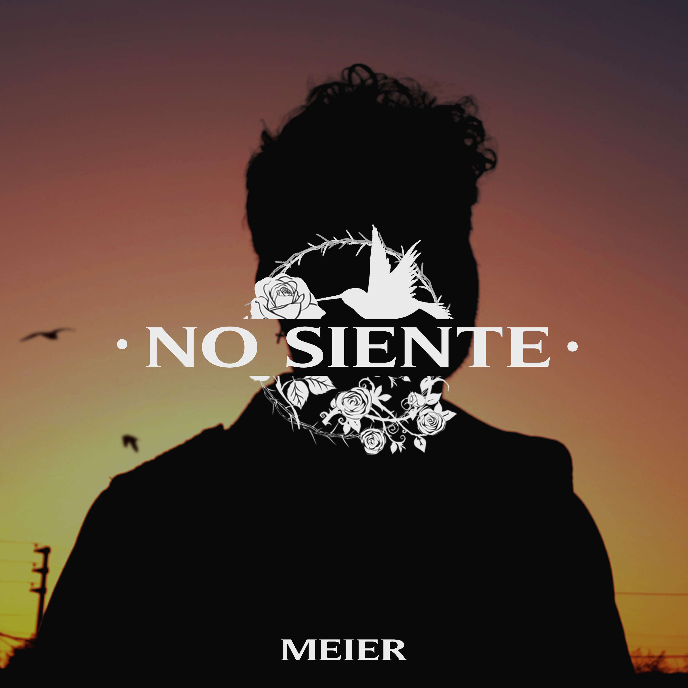
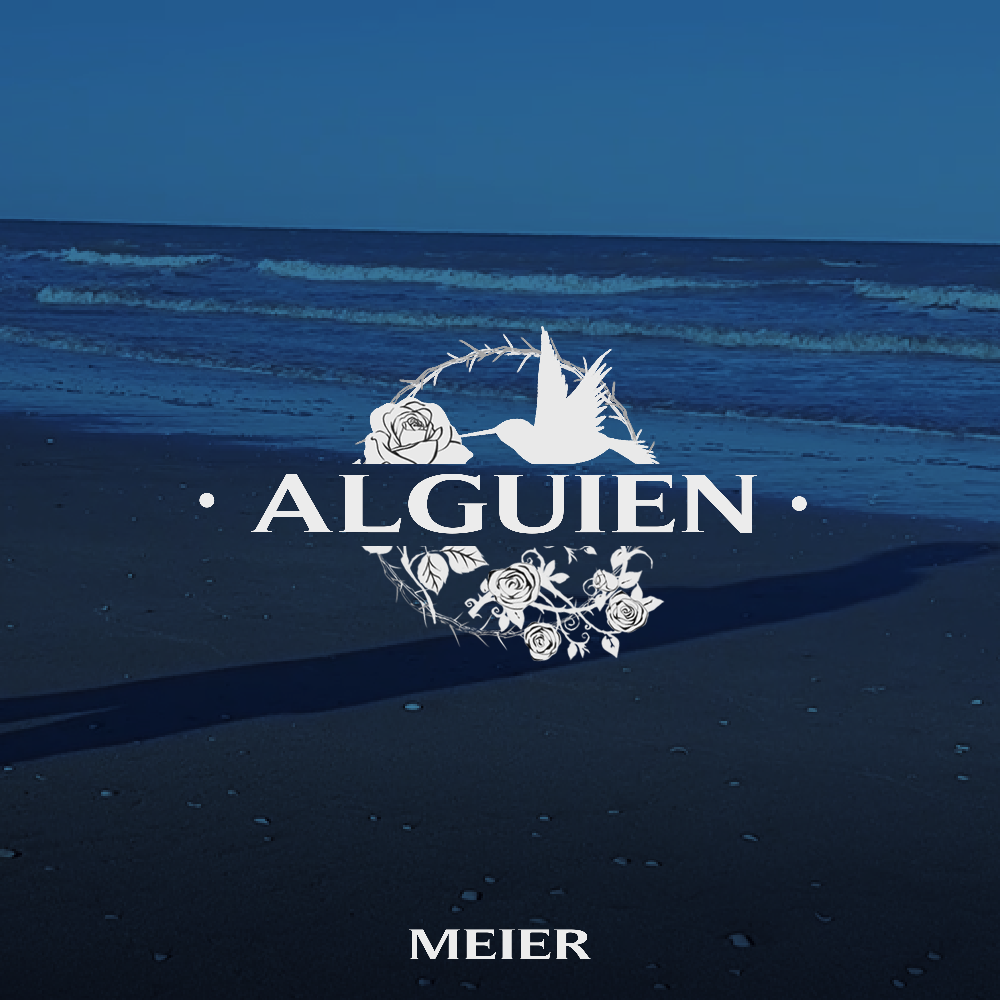

<p align="center"></p>

<h1 align="center">Proyecto: Meier Official Website</h1>

## Autor - Mateo Leotta Meier
Proyecto final del curso de Desarrollo Web de Coderhouse

## Descripción
Sitio Web Oficial de Meier, aquí puedes enterarte de sus próximos lanzamientos y shows, además de su historia e información exclusiva del artista argentino.

## Tecnologías

<p align="center"></p>

## Software

<p align="center"></p>

## Desarrollo 

**NabVar Responsive con Bootstrap y Video Animado de Fondo**

*HTML*

```html
    <header>
        <!-- Barra de navegación con Bootstrap -->
        <video src="./assets/video/fondoanimado6.mp4" autoplay="true" muted="true"></video>
        <nav class="navbar navbar-expand-lg">
            <div class="container-fluid">
                <button class="navbar-toggler" type="button" data-bs-toggle="offcanvas" data-bs-target="#offcanvasNavbar" aria-controls="offcanvasNavbar">
                    <span class="navbar-toggler-icon"></span>
                </button>   
                <a href="index.html"></a>
                <div class="offcanvas offcanvas-end" tabindex="-1" id="offcanvasNavbar" aria-labelledby="offcanvasNavbarLabel">
                    <div class="offcanvas-header">
                        <h5 class="offcanvas-title" id="offcanvasNavbarLabel"></h5>
                        <button type="button" class="btn-close" data-bs-dismiss="offcanvas" aria-label="Close"></button>
                    </div>
                    <div class="offcanvas-body">
                        <ul class="navbar-nav">
                            <li class="nav-item">
                                <a class="nav-link active" aria-current="page" href="./pages/galeria.html">GALERÍA</a>
                            </li>
                            <li>
                                
                            </li>
                            <li class="nav-item">
                                <a class="nav-link active" aria-current="page" href="./pages/discografia.html">DISCOGRAFÍA</a>
                            </li>
                            <li class="nav-item">
                                <a href="index.html"></a>
                            </li>
                            <li class="nav-item">
                                <a class="nav-link active" aria-current="page" href="./pages/fechas.html">CONCIERTOS</a>
                            </li>
                            <li>
                                
                            </li>
                            <li class="nav-item">
                                <a class="nav-link active" aria-current="page" href="./pages/contacto.html">CONTACTO</a>
                            </li>  
                        </ul>
                    </div>
                </div>
            </div>
        </nav>
    <!-- Link al contenido de página -->
        <div class="arrowContainer" >
            <a class="arrow" href="#main"></a>
        </div>

    </header>
```

*SASS*

```sass

header {
	width: 100%;
	overflow: hidden;
	position: relative;
	.arrow {
		width: 50px;
		height: 50px;
		&:hover {
			filter: drop-shadow(0 2px 5px rgba(0, 0, 0, 0.7));
			transition: 0.4s;
		}
	}
}
.navBarMini {
	width: 100%;
	display: flex;
	.containerMini {
		width: 100%;
		height: 200px;
		display: flex;
		flex-wrap: wrap;
		align-items: center;
		justify-content: center;
		gap: 75px;
	}
	li {
		width: 235px;
		height: 180px;
		display: flex;
		flex-wrap: nowrap;
		align-items: center;
		list-style: none;
		a {
			display: inline-block;
			font-size: 40px;
			font-family: $typo_title;
			font-weight: bold;
			text-decoration: none;
			color: black;
			letter-spacing: 0.10rem;
			&:hover {
				text-shadow: 0 0 10px rgba(0, 0, 0, 0.7);
				transition: 0.4s;
			}
		}
	}
}
.navBar {
	width: 100%;
	display: flex;
}
.navbar-nav {
	width: 100%;
	height: 525px;
	display: flex;
	flex-wrap: wrap;
	align-items: center;
	justify-content: center;
}
.nav-item {
	width: 180px;
	overflow: hidden;
	display: flex;
	flex-wrap: nowrap;
	justify-content: center;
	list-style: none;
}
.nav-link {
	display: inline-block;
	font-size: 40px;
	text-decoration: none;
	color: black;
	font-family: $typo_title;
	font-weight: normal;
	font-size: 1.5rem;
	letter-spacing: 0.10rem;
	&:hover {
		text-shadow: 0 0 10px rgba(0, 0, 0, 0.7);
		transition: 0.4s;
	}
}
.navbar-toggler-icon {
	background-image: url(../assets/img/hamburguer.png);
	width: 50px;
	height: 50px;
}
.point {
	width: 20px;
	height: 20px;
}
ol, ul {
	padding: 0;
}

video {
	position: fixed;
	right: 0;
	bottom: 0;
	min-width: 100%;
	min-height: 100%;
	transform: translateX(calc((100% - 100vw) / 2));
	z-index: -2;
}

```

**Cards Semi-transparentes con Flexbox, Filter y SASS**

*HTML*

```html
            <section class="container4">
                <article class="noSiente">
                    <div class="songsBox1">
                        <a class="amuse" href="https://share.amuse.io/track/meier-no-siente" target="_blank"></a>
                        <div>
                            <h2>No Siente</h2>
                            <h3>Meier</h3>
                            <p class="songdesc">Último Single, un festival de Hip-Hop y R&B en la terraza, subiendo un poco más el nivel.</p>
                            <a href="./pages/discografia.html#ns"><button type="button" class="btn btn-light">Más...</button></a>
                            <a href="#v1"><button type="button" class="btn btn-light">Ver Video</button></a>
                        </div>
                    </div>
                </article>
                <article>
                    <div class="songsBox1">
                        <a class="amuse" href="https://share.amuse.io/track/meier-alguien" target="_blank"></a>
                        <div>
                            <h2>Alguien</h2>
                            <h3>Meier</h3>
                            <p class="songdesc">La primera canción, su primera producción y su primer salto al mundo de la música.</p>
                            <a href="./pages/discografia.html#as"><button type="button" class="btn btn-light">Más...</button></a>
                            <a href="#v2"><button type="button" class="btn btn-light">Ver Video</button></a>
                        </div>
                    </div>
                </article>
            </section>
```

*SASS*

```sass
article {
	width: 100%;
	overflow: hidden;
}
.container4 {
	.noSiente {
		display: flex;
		justify-content: flex-end;
	}
}
.glassmorphism{
	background: rgba(202, 202, 202, 0.5);
	border-radius: 16px;
	box-shadow: 0 4px 30px rgba(0, 0, 0, 0.2);
	backdrop-filter: blur(5px);
	-webkit-backdrop-filter: blur(5px);
	border: 1px solid rgba(202, 202, 202, 0.3);
}
.songsBox1 {
	@extend .glassmorphism;
	display: flex;
	flex-flow: column wrap;
	overflow: hidden;
	align-items: flex-start;
	padding: 4%;
	margin: 2%;
	margin-left: auto;
	margin-right: auto;
	margin-bottom: 30px;
	width: 90%;
}
```

## Tipografías
**- NavBar: DM Serif Display, serif.**
<p align="center"></p>

**- Headings y Párrafos: Gotham, sans-serif.**
<p align="center"></p>

 <h1 align="center">Copyright ℗Meier 2023</h1>